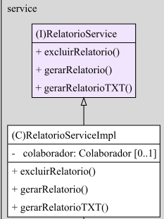
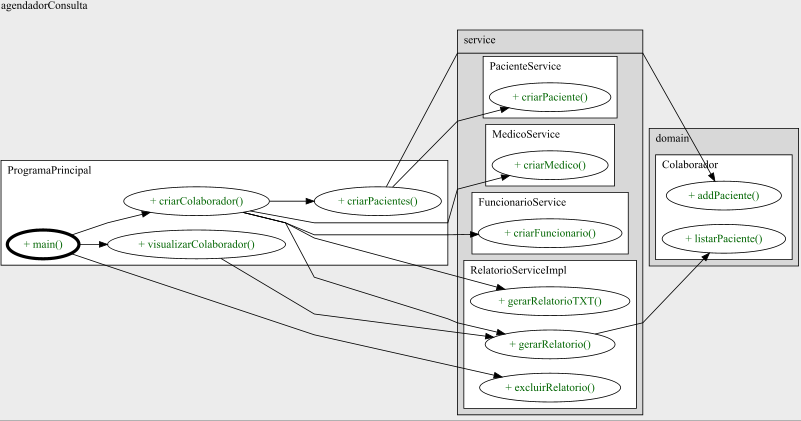

###  Projeto Agendador de Consultas em POO
## Descrição
Projeto de Programação Orientada a Objetos em Java, onde se utilizamos de classes classes utilitárias nativas da linguagem, tecnologias de batch e principalmente o paradigma da orientação a objetos. O projeto é um sistema simples para o gerenciamento de um hospital, onde você pode cadastrar e visualizar colaboradores. Os colaboradores possuem pacientes que estão vinculados ao mesmo, podendo então gerar um relatório com todas essas informações, tanto no console quanto na criação de um arquivo de texto para armazenamento dos dados. 

## Tecnologias
- Java
- Batch
- Regex


## Como usar
1. Abra sua IDE Java de preferência
2. Clone o repositório
   ```sh
   git clone https://github.com/Mario-Juu/consultasPOO.git
   ```
3. Dê run na aplicação.
4. Siga o passo a passo do projeto.

## Diagramas
### Diagrama de Classes



### Diagrama de Fluxo



 
